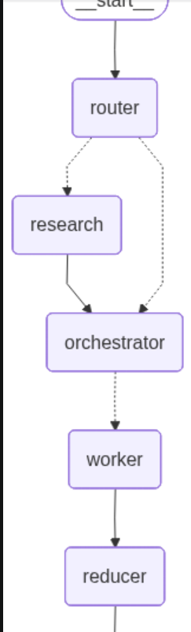

# AI-Powered Multi-Agent Blog Writer

A multi-agent AI application built using LangGraph that can research, plan, write, and assemble complete technical blog posts.

## Architecture

Topic → Router → Research → Orchestrator → Parallel Workers → Reducer → Image Planner → Final Blog

## Workflow Architecture(diagram)

## Features

- Web Research (Tavily)
- Multi-Agent Workflow
- Parallel Content Generation
- Automated Blog Planning
- AI Image Planning
- Streamlit UI

## Tech Stack

- Python
- LangGraph
- LangChain
- Gemini
- Tavily
- Streamlit

